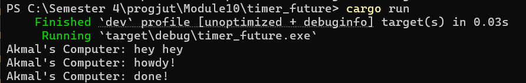
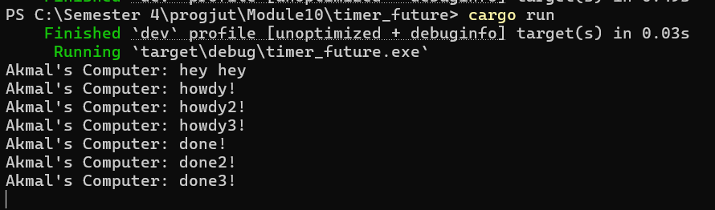
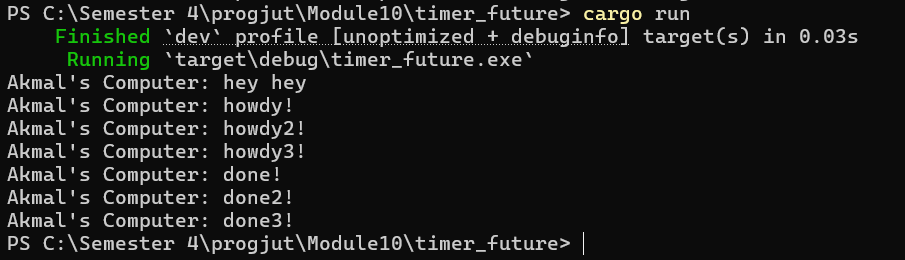

## 1.2 Understanding How It Works  
  
Ketika main dijalankan, task `howdy!` dan `done!` akan dibuat dan  dimasukkan ke dalam antrian tetapi tidak langsung dijalankan. Setelah task dibuat, `hey hey` akan langsung ditampilkan karena tidak dimasukkan antrian terlebih dahulu. Setelah executor dijalankan, barulah task `howdy!` dan `done!` dijalankan.  

## 1.3 Multiple Spawn and removing drop  
tanpa `drop(spawner)`  

ketika mereplika spawn, semua task akan dimasukkan ke dalam antrian. Sama seperti sebelumnya, `hey hey` akan dijalankan terlebih dahulu. `howdy!`, `howdy1!`, `howdy2!` akan dijalankan lalu setelah dua detik menjalankan `done!`, `done1!`, `done2!`.  Tetapi, tanpa perintah `drop(spawner)`, executor tidak langsung berhenti melainkan executor menunggu task selanjutnya untuk dijalankan. 

dengan `drop(spawner)`  
  
sama seperti sebelumnya tetapi dengan `drop(spawner)`, executor akan berhenti berjalan ketika semua task sudah selesai.